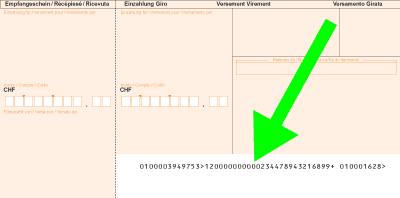
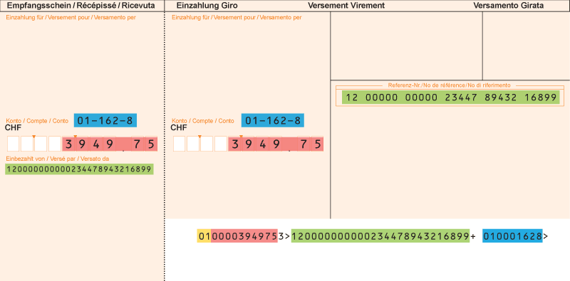

# Code Line Generator for Orange Payment Slips used in Switzerland

This package contains utility functions for generating the code line on the orange payment slips used in Switzerland. The number is shown on the bottom right of the slip inside the white area:



Note: **The QR-Bill replaces this standard.** See [paymentstandards.ch](https://www.paymentstandards.ch/).

## Specification

The slip is known under these different names and abbreviations depending on the language:

- English: _Orange inpayment slip with reference number (ISR)_
- German: _Oranger Einzahlungsschein mit Referenznummer (ESR)_
- French: _Bulletin de versement orange avec numéro de référence (BVR)_
- Italian: _Polizza di versamento arancione con numero di riferimento (PVR)_

The technical specification is from chapter 5 of the [Postfinance manual](https://www.postfinance.ch/content/dam/pfch/doc/cust/download/inpayslip_isr_man_en.pdf).

## Installation

```bash
npm install esr-code-line
```

## Usage

The code line consists of information already on the payment slip, except for the slip type:



The parameters are:

- `slipType` a code defining the type of the slip. E.g. "01" for a ISR in CHF.
- (red) `amountFrancsOrEuros` the main currency unit in either CHF or EUR.
- (red) `amountRappenOrCents` the fractional currency unit in Rappen or Cents.
- (green) `referenceNumber` the reference number with or without spaces.
- (blue) `customerNumber` the ISR customer number in CHF or EUR. Formatted VV-XXX-C (ISR code - serial number - check digit).

```js
codeLine(
  "01",
  "3949",
  "75",
  "12 00000 00000 23447 89432 16899",
  "01-162-8"
);
```

The codeLine function does not add check digits to the reference or customer numbers. They can however be added using the `attachCheckDigit` function included in the module.

```js
attachCheckDigit("04"); // returns "042"
```
